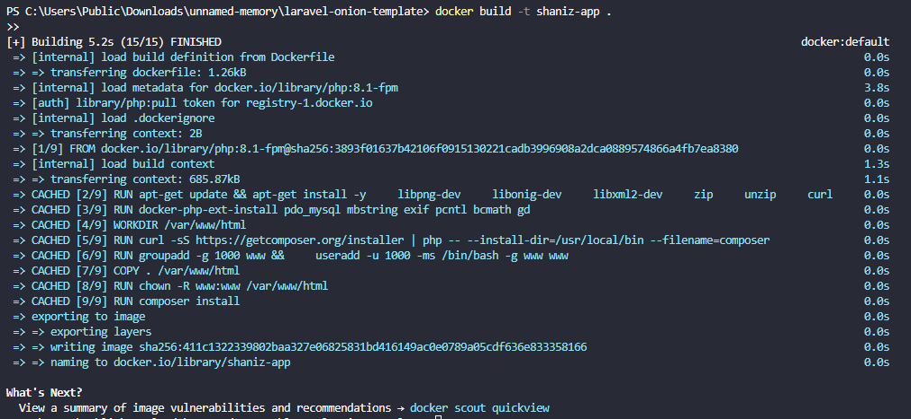
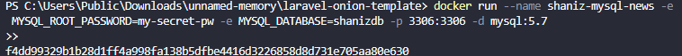

[](https://classroom.github.com/a/jYae_yK9)
<div align=center>

|    NRP     |      Name      |
| :--------: | :------------: |
| 5025221007 | Yehezkiella Felicia Jeis Timbulong |
| 5025221047 | Muhammad Rayyaan Fatikhahur Rakhim |
| 5025221103 | Hilmi Fawwaz Sa'ad |

# Praktikum Modul 3 _(Module 3 Lab Work)_

</div>

### Daftar Soal _(Task List)_

- [Task 1 - Jess No Limit Push Rank](/task-1/)

- [Task 2 - BNBWT](/task-2/)

- [Task 3 - Volume Expansion](/task-3/)

- [Task 4 - WOTA Competition](/task-4/)

### Laporan Resmi Praktikum Modul 3 _(Module 3 Lab Work Report)_

Tulis laporan resmi di sini!

_Write your lab work report here!_

## 1️⃣ Soal 1
### Problem 1a
Download dataset menggunakan `kaggle datasets download -d irwansyah10010/mobilelegend` setelah berhasil mendownload dengan format file .zip, langkah selanjutnya adalah mengekstrak file tersebut. Kalian melakukannya di dalam file `ayamgoreng.c` untuk semua pengerjaannya

**Jawab**

*1. Sebelum memulai program, kita harus setup environtment terlebih dahulu. Instal pip (Python Package Installer) di sistem yang digunakan*
```bash
sudo apt update
```
```bash
sudo apt install python3-pip
```

*2. Jika sudah, selanjutnya install Kaggle CLI*
```bash
pip install kaggle
```

*3. Setelah berhasil menginstal Kaggle CLI, konfigurasi kredensial Kaggle dengan membuka halaman Kaggle, pergi ke tab "Account", dan klik pada tombol "Create API Token". Lalu akan mengunduh file kaggle.json.*

*4. Pindahkan file kaggle.json ke direktori ~/.kaggle/. Jika menggunakan wsl, bisa langsung memindahkan secara manual dengan masuk ke \\wsl.localhost/Ubuntu/home/{username}/.kaggle*

*5. Setelah selesai setup environtment, kita lanjutkan ke program ayamgoreng.c. Pertama adalah membuat struct untuk menampung nama hero, role, dan point skillnya*
```C
#include <stdio.h>
#include <string.h>
#include <stdlib.h>
#include <unistd.h>
#include <sys/wait.h>
#include <stdbool.h>
#define MAX 300 //remove and hero total
#define MAX_LINE 1000

typedef struct {
    char namaHero[40];
    char role[2][40];  // array untuk menyimpan hero yang memiliki 2 role
    int skillPoints;
} Hero;
```
- `char namaHero[40]` adalah array untuk menyimpan nama hero
- `char role[2][40]` adalah array dua dimensi untuk menyimpan role yang dimiliki hero. Ini untuk menangani apabila hero memiliki 2 role, contohnya Minotaur dengan role TANK/SUPPORT
- `int skillPoints` adalah variabel bertipe integer digunakan untuk menyimpan jumlah poin

*6. Membuat fungsi untuk mendownload dan mengekstrak file dari link : kaggle datasets download -d irwansyah10010/mobilelegend. Saya disini menggunakan fork untuk prosesnya*
```C
void download_extract_datasets(char *path) {
    int status;
    pid_t pid;
    pid = fork();
    
    if (pid == 0) {
        // child process
        execlp("kaggle", "kaggle", "datasets", "download", "-d", "irwansyah10010/mobilelegend", "-p", path, NULL);
        perror("execlp");
        exit(1);
    }
    else if (pid > 0) {
        // parent process
        wait(&status); 
        if (WIFEXITED(status) && WEXITSTATUS(status) == 0) {
            printf("Download zip berhasil.\n");
            if (fork() == 0) {
                char zip_path[100]; // atau ukuran yang lebih besar jika diperlukan
                snprintf(zip_path, sizeof(zip_path), "%s/mobilelegend.zip", path);
                execlp("unzip", "unzip", "-q", "mobilelegend.zip", "-d", path, NULL); // mengextract file zip
                perror("execlp");
                exit(1);
            } else {
                wait(NULL); // menunggu child process selesai
                printf("Ekstraksi file zip berhasil.\n");
            }
        } else {
            printf("Download zip gagal.\n");
        }
    }    
    else {
        perror("fork");
        exit(EXIT_FAILURE);
    }
}
```
- Fungsi ini menerima satu parameter berupa string yang merupakan path (lokasi) tempat dataset akan diunduh dan diekstrak
- Menggunakan `fork()` untuk melakukan download dan ekstrak file .zip
- `execlp()` dipanggil untuk menjalankan perintah Kaggle CLI (`kaggle datasets download -d irwansyah10010/mobilelegend -p <path>`)
- Parent process menunggu child process selesai dengan `wait(&status)`. Jika child process selesai, maka akan mengoutputkan bahwa download telah berhasil
- Setelah itu child process untuk mengekstrak file zip yang sudah di download dengan `execlp("unzip", "unzip", "-q", "mobilelegend.zip", "-d", path, NULL)`

*7. Selanjutnya, saya membuat fungsi untuk menghapus file .zip yang tidak digunakan (walaupun di soal tidak ada perintahnya)*
```C
void remove_zip(char *path) {
    char zip_path[MAX];
    snprintf(zip_path, sizeof(zip_path), "%s/mobilelegend.zip", path);
    
    if (fork() == 0) {
        execlp("rm", "rm", "-f", "mobilelegend.zip", NULL);
        perror("execlp");
        exit(1);
    } else {
        wait(NULL);
        printf("File zip berhasil dihapus.\n");
    }
}
```
- Fungsi ini yang menerima satu parameter berupa string yang merupakan path (lokasi) tempat file .zip berada
- Membuat child process dan mengeksekusi perintah `execlp("rm", "rm", "-f", "mobilelegend.zip", NULL)`
- Perintah `rm` untuk menghapus file zip dan `-f` untuk menghapus file tanpa mengkonfirmasi pengguna

*8. Setelah pembuatan fungsi, selanjutnya kita beralih ke Main Function*
```C
int main(int argc, char *argv[])
{
    char *ori_path = ".";
    Hero heroes[MAX];
    Hero best_heroes[6]; // inisialisasi array untuk menyimpan pahlawan terbaik untuk setiap peran

    download_extract_datasets(ori_path); // mendownload dan ekstrak zip
    remove_zip(ori_path); // menghapus zip

    .....
}
```
- `char *ori_path = "."` adalah variabel untuk menyimpan path (lokasi) saat in
- `Hero heroes[MAX]` adalah array untuk menyimpan data tentang pahlawan (hero) dari dataset yang akan diunduh dan diekstrak
- `Hero best_heroes[6]` adalah array untuk menyimpan pahlawan terbaik untuk setiap peran dengan ukuran 6, dimana sesuai dengan jumlah role yang ada
- Fungsi `download_extract_datasets()` untuk engunduh dataset dari Kaggle, mengekstraknya, dan menyimpannya di path yang ditentukan
- Fungsi `remove_zip()`untuk menghapus file zip setelah dataset diekstrak dari path yang ditentukan

*9. Dokumentasi. Program saya jalankan sesuai Main Function yang saya tunjukkan di atas*
- Terminal

- Hasil download dan ekstrak dan remove zip


### Problem 1b
`ayamgoreng.c` harus bisa mengoutputkan semua hero yang terbaik pada setiap role secara default tanpa argumen, namun juga bisa menampilkan sesuai dengan role yang diberikan pada argumen pada saat pemanggilan program (`./ayamgoreng [role]`). Data hero beserta rolenya dapat dilihat pada file identitas.csv, sedangkan data hero beserta atributnya dapat dilihat pada file atribut-hero.csv. Keluarkan informasi mengenai hero dan skillpointsnya dengan format `Hero terbaik adalah (nama hero) dengan skillpoint (jumlah skillpoint)`.

**Jawab**

*1. Membuat fungsi untuk membaca csv dan menyimpan nama hero beserta role-nya*
```C
int read_identitas_hero(const char *csvname, Hero heroes[]) {
    FILE *file = fopen(csvname, "r");
    if (file == NULL) {
        perror("Error opening file");
        exit(EXIT_FAILURE);
    }

    int count = 0;
    char line[MAX_LINE];
    bool firstLine = true;
    while (fgets(line, MAX_LINE, file) != NULL && count < MAX) {
        if (firstLine) {
        firstLine = false;
        continue;
        }

        char temp_name[40], temp_role[40];
        sscanf(line, "%[^;];%[^;];%*[^;];%*s", temp_name, temp_role);
        char *token = strtok(temp_role, "/");
        int role_count = 0;
        while (token != NULL && role_count < 2) {
            strcpy(heroes[count].namaHero, temp_name);
            strncpy(heroes[count].role[role_count], token, sizeof(heroes[count].role[role_count]) - 1);
            heroes[count].role[role_count][sizeof(heroes[count].role[role_count]) - 1] = '\0'; // memastikan akhiran string
            count++;
            token = strtok(NULL, "/");
        }
    }
    fclose(file);
    return count;
}
```
- Fungsi ini menerima dua parameter, yaitu `csvname` yang merupakan path nama file CSV yang akan dibaca, dan `heroes[]` yang merupakan array dari tipe `Hero` di mana data hero akan disimpan
- `int count = 0` digunakan untuk menghitung jumlah hero yang berhasil dibaca dan disimpan
- `char line[MAX_LINE]` digunakan untuk menyimpan satu baris dari file CSV yang sedang dibaca
- `bool firstLine = true`digunakan untuk memeriksa apakah baris yang sedang dibaca adalah baris pertama dari file CSV. Jika iya, maka akan diabaikan dan mengubah `firstLine` menjadi `False` 
- `while (fgets(line, MAX_LINE, file) != NULL && count < MAX)` adalah loop while yang membaca setiap baris dari file CSV menggunakan `fgets`
- `char temp_name[40]` dan `temp_role[40]` digunakan untuk menyimpan nama dan peran sementara dari hero yang sedang dibaca
- `sscanf` digunakan untuk memformat dan memindai string yang terbaca dari `line` dengan memisahkan nama hero dan role-nya
- Karena dalam dataset satu hero dapat memiliki lebih dari satu role, maka `char *token = strtok(temp_role, "/")` digunakan untuk memisahkan kedua role tersebut. Selanjutnya, loop while akan membaca setiap token dari string `temp_role` (peran hero). Loop akan berhenti jika tidak ada token lagi yang dapat dibaca atau jika jumlah peran hero yang telah dibaca sudah mencapai 2
- Di dalam loop, data hero (nama dan role) akan disimpan dalam array `heroes[]`
- `token = strtok(NULL, "/")` digunakan untuk melanjutkan proses pemecahan string yang dimulai oleh pemanggilan sebelumnya ke fungsi `strtok()`
- `return count` digunakan untuk mengembalikan jumlah hero yang berhasil dibaca dan disimpan dalam array `heroes[]`

*2. Selanjutnya, kita membuat fungsi untuk menghitung point skill setiap hero dengan rumus yang sudah diberikan sesuai role-nya*
```C
void calculate_point(const char *csvskill, int data_hero, Hero heroes[]) {
    FILE *skill = fopen(csvskill, "r");
    if (skill == NULL) {
        perror("Error opening file");
        exit(EXIT_FAILURE);
    }

    char line[MAX_LINE];
    int total_point = 0;
    while(fgets(line, MAX_LINE, skill) != NULL) {
        char namaHero[40];
        float hp, physical_attack, attack_speed, mana, mana_regen, attack_speed_total;

        sscanf(line, "%[^;];%f;%*f;%f;%*f;%f;%*f;%f;%f;%*f;%*f;%*f;%*f;%*f;%*f;%*f;%*f;%*f;%*f;%*f;%*f;%*f;%*f;%*f;%*f;%*f;%f", 
            namaHero, &hp, &physical_attack, &attack_speed, &mana, &mana_regen, &attack_speed_total);

        for (int i = 0; i < data_hero; i++) {
            if (strcmp(heroes[i].namaHero, namaHero) == 0) {
            for (int j = 0; j < 2 && heroes[i].role[j][0] != '\0'; j++) {
                if (strcmp(heroes[i].role[j], "TANK") == 0) {
                total_point += hp;
                } else if (strcmp(heroes[i].role[j], "ASSASSIN") == 0) {
                total_point += physical_attack;
                } else if (strcmp(heroes[i].role[j], "FIGHTER") == 0) {
                total_point += hp + physical_attack;
                } else if (strcmp(heroes[i].role[j], "MM") == 0) {
                total_point += physical_attack * attack_speed;
                } else if (strcmp(heroes[i].role[j], "MAGE") == 0) {
                total_point += mana / mana_regen;
                } else if (strcmp(heroes[i].role[j], "SUPPORT") == 0) {
                total_point += mana_regen + hp;
                }
            }
            heroes[i].skillPoints = total_point;
            }
            total_point = 0;
        }
    }
    fclose(skill);
}
```
- Fungsi ini menerima tiga parameter, yaitu `csvskill` yang merupakan path nama file CSV yang berisi data keterampilan (skill) hero, `data_hero` yang merupakan jumlah hero yang telah dibaca dan disimpan, dan `heroes[]` yang merupakan array dari tipe `Hero` yang berisi data hero
- Setelah membaca filenya, program akan membaca setiap baris dari file CSV menggunakan fgets dengan `while` loop. Loop akan berhenti jika tidak ada baris lagi yang dapat dibaca
- `sscanf` digunakan untuk memformat dan memindai string yang terbaca dari line, yang berisi data keterampilan hero. Data yang terbaca kemudian disimpan dalam variabel-variabel yang sesuai
- Setelah data keterampilan hero terbaca, dilakukan perulangan untuk mencocokkan nama hero dari file CSV dengan nama hero yang sudah disimpan sebelumnya dalam array `heroes[]`. Jika nama hero cocok, maka dilakukan perulangan lagi untuk setiap peran hero yang dimilikinya.Di dalam perulangan untuk setiap peran hero, nilai total poin keterampilan `total_point` dihitung berdasarkan aturan/operasi yang diberikan, sesuai dengan peran masing-masing hero. 
- Setelah perulangan selesai, nilai `total_point` disimpan dalam atribut `skillPoints` dari struktur `Hero` yang bersangkutan

*3. Setelah mendapatkan semua poin skill hero untuk setiap rolenya, dilanjutkan membuat fungsi untuk mencari hero dengan poin skill terbaik/tertinggi dari masing-masing role*
```C
void best_hero(int data_hero, Hero heroes[], Hero best_heroes[6]) {
    int max_points[6] = {0}; // inisialisasi array untuk menyimpan poin maksimum untuk setiap role
    for (int i = 0; i < data_hero; i++) {
        for (int j = 0; j < 2 && heroes[i].role[j][0] != '\0'; j++) {
            if (strcmp(heroes[i].role[j], "TANK") == 0 && heroes[i].skillPoints > max_points[0]) {
                max_points[0] = heroes[i].skillPoints;
                strcpy(best_heroes[0].namaHero, heroes[i].namaHero);
                strcpy(best_heroes[0].role[0], heroes[i].role[0]);
                best_heroes[0].skillPoints = heroes[i].skillPoints;
            } else if (strcmp(heroes[i].role[j], "ASSASSIN") == 0 && heroes[i].skillPoints > max_points[1]) {
                max_points[1] = heroes[i].skillPoints;
                strcpy(best_heroes[1].namaHero, heroes[i].namaHero);
                strcpy(best_heroes[1].role[0], heroes[i].role[0]);
                best_heroes[1].skillPoints = heroes[i].skillPoints;
            } else if (strcmp(heroes[i].role[j], "FIGHTER") == 0 && heroes[i].skillPoints > max_points[2]) {
                max_points[2] = heroes[i].skillPoints;
                strcpy(best_heroes[2].namaHero, heroes[i].namaHero);
                strcpy(best_heroes[2].role[0], heroes[i].role[0]);
                best_heroes[2].skillPoints = heroes[i].skillPoints;
            } else if (strcmp(heroes[i].role[j], "MM") == 0 && heroes[i].skillPoints > max_points[3]) {
                max_points[3] = heroes[i].skillPoints;
                strcpy(best_heroes[3].namaHero, heroes[i].namaHero);
                strcpy(best_heroes[3].role[0], heroes[i].role[0]);
                best_heroes[3].skillPoints = heroes[i].skillPoints;
            } else if (strcmp(heroes[i].role[j], "MAGE") == 0 && heroes[i].skillPoints > max_points[4]) {
                max_points[4] = heroes[i].skillPoints;
                strcpy(best_heroes[4].namaHero, heroes[i].namaHero);
                strcpy(best_heroes[4].role[0], heroes[i].role[0]);
                best_heroes[4].skillPoints = heroes[i].skillPoints;
            } else if (strcmp(heroes[i].role[j], "SUPPORT") == 0 && heroes[i].skillPoints > max_points[5]) {
                max_points[5] = heroes[i].skillPoints;
                strcpy(best_heroes[5].namaHero, heroes[i].namaHero);
                strcpy(best_heroes[5].role[0], heroes[i].role[0]);
                best_heroes[5].skillPoints = heroes[i].skillPoints;
            }
        }
    }
}
```
- Fungsi ini menerima tiga parameter, yaitu `data_hero` yang merupakan jumlah hero yang telah dibaca dan disimpan, dan `heroes[]` yang merupakan array dari struktur `Hero` yang berisi data hero, dan `best_heroes[6]` yang merupakan array dari struktur `Hero` untuk menyimpan data hero dengan poin skill terbaik
- `int max_points[6] = {0}` digunakan untuk menyimpan jumlah poin maksimum untuk setiap role. Array ini diinisialisasi dengan nilai 0 untuk setiap role
- Nested loop digunakan untuk memeriksa setiap hero dan setiap perannya. Loop pertama digunakan untuk mengakses setiap hero dalam array `heroes[]`, sedangkan loop kedua digunakan untuk mengakses setiap role dari hero tersebut
- Jika role yang dimiliki sama, maka akan dilakukan perbandingan poin skill. Jika jumlah poin skill hero tersebut lebih besar dari poin maksimum yang telah disimpan sebelumnya, maka poin maksimum tersebut diperbarui dengan nilai poin skukk hero, dan informasi hero tersebut disalin ke array `best_heroes[]`

*4. Setelah semua fungsi ada, lanjut ke Main Function*
```C
int main(int argc, char *argv[])
{
    .....

    char *csvhero = "./Data Mobile Legend/identitas.csv";
    char *csvskill = "./Data Mobile Legend/Atribut/atribut-hero.csv";
    
    int data_hero = read_identitas_hero(csvhero, heroes); // membaca dan menyimpan data hero
    calculate_point(csvskill, data_hero, heroes); // menghitung poin skill setiap hero
    best_hero(data_hero, heroes, best_heroes); // mencari hero dengan poin skill tertinggi untuk setiap role

    // periksa apakah argumen role ada
    if (argc > 1) {
        char *role = argv[1];
        printf("\nHero terbaik untuk role:\n");
        printf("-- %s --\n", role);
        for (int i = 0; i < 6; i++) {
            if (strcmp(best_heroes[i].role[0], role) == 0) {
                printf("Hero terbaik adalah %s dengan skillpoint %d\n", best_heroes[i].namaHero, best_heroes[i].skillPoints);
            }
        }
    }
    else {
        // rinr hero terbaik untuk setiap role
        printf("\nHero terbaik setiap role:\n");
        for (int i = 0; i < 6; i++) {
            printf("-- %s --\n", best_heroes[i].role[0]);
            printf("Hero terbaik adalah %s dengan skillpoint %d\n", best_heroes[i].namaHero, best_heroes[i].skillPoints);
        }
    }

    return 0;
}
```
- `csvhero` dan `csvskill` dideklarasikan untuk menyimpan path ke dua file CSV. `csvhero` berisi path ke file CSV yang berisi informasi identitas hero, sedangkan `csvskill` berisi path ke file CSV yang berisi atribut keterampilan hero
- Pemanggilan fungsi `read_identitas_hero` untuk membaca dan menyimpan data hero dari file CSV ke dalam array `heroes[]`. Kemudian data tersebut disimpan dalam variabel `data_hero`
- Pemanggilan fungsi `calculate_point` dan juga `best_hero`
- Pada _Main Function_, program memiliki 2 kondisi, yaitu ketika ada argumen dan juga tidak ada argumen. Kondisi pertama, jika ada argumen role yang diberikan saat menjalankan program, maka program akan mengeksekusi blok `if (argc > 1)` dan menampilkan informasi hero terbaik untuk role yang diberikan.
- Kondisi kedua, jika tidak ada argumen yang diberikan saat menjalankan program, maka program akan mengeksekusi blok `else` dan menampilkan informasi hero terbaik untuk semua role

*5. Dokumentasi*
- Terminal (ketika tidak ada argumen)

- Terminal (ketika ada argumen)


### Problem 1c
Jess No Limit menyadari bahwa sistem kalian sangat berguna dan ingin sistem ini bisa diakses oleh teman satu timnya. Oleh karena itu, kalian perlu menjadikan sistem yang dibuat ke sebuah Docker Container agar mudah di-distribute dan dijalankan di lingkungan lain tanpa perlu setup environment dari awal. Buatlah Dockerfile yang berisi semua langkah yang diperlukan untuk setup environment dan menentukan bagaimana aplikasi harus dijalankan. Notes: Command yang dijalankan pada docker file tidak terdapat argumen dan akan menampilkan semua role

**Jawab**

*1. Dockerfile*
```Dockerfile
# Base Image
FROM ubuntu:latest

# Instal Dependencies
RUN apt-get update
RUN apt-get install -y \
    gcc \
    unzip \
    python3 \
    python3-pip \
    python3-venv
RUN apt-get clean

# Create and activate virtual environment
RUN python3 -m venv /opt/venv
ENV PATH="/opt/venv/bin:${PATH}"

# Install Kaggle CLI
RUN pip install kaggle

# Generate Kaggle API Key
RUN mkdir -p /root/.kaggle && \
    echo '{"username":"hfwzsd","key":"1be2d13700ab981c07f30afcca6d057d"}' > /root/.kaggle/kaggle.json && \
    chmod 600 /root/.kaggle/kaggle.json

# Set working directory
WORKDIR /APP

# Copy source code to working directory
COPY ayamgoreng.c .

# Set execute permission
RUN chmod +x ayamgoreng.c

# Compile source code
RUN gcc -o ayamgoreng ayamgoreng.c
```
- `FROM ubuntu:latest` merubakan base image untuk membangun container Docker. Image dasar adalah gambar yang digunakan sebagai titik awal untuk membangun dan menjalankan container Docker. Dalam hal ini, dipilih menggunakan image ubuntu:latest, yang merupakan versi terbaru dari sistem operasi Ubuntu.
- `RUN apt-get update` untuk memperbarui daftar paket pada image
- `RUN apt-get install -y \ gcc \ unzip \ python3 \ python3-pip \ python3-venv` untuk dependensi yang dibutuhkan, termasuk GCC (GNU Compiler Collection) untuk kompilasi, unzip untuk mengekstrak file, dan Python 3 serta beberapa paket pendukungnya
- `gcc` adalah kompiler C yang diperlukan untuk mengkompilasi kode C
- `unzip` adalah utilitas untuk mengekstrak file ZIP
- `python3` adalah interpreter Python versi 3, yang diperlukan untuk menjalankan skrip Python dalam container
- `python3-pip` adalah alat manajemen paket untuk Python versi 3, yang diperlukan untuk menginstal paket-paket Python tambahan
- `python3-venv` adalah paket di lingkungan Python yang menyediakan modul venv untuk membuat lingkungan virtual Python
- `RUN apt-get clean` untuk membersihkan cache yang dihasilkan oleh apt-get untuk mengurangi ukuran image
- `RUN python3 -m venv /opt/venv` untuk membuat dan mengaktifkan virtual environment Python di direktori `/opt/venv`
- `ENV PATH="/opt/venv/bin:${PATH}"` untuk mengatur PATH environment variable agar mencakup direktori `/opt/venv/bin`, sehingga perintah-perintah yang terinstal di virtual environment dapat diakses secara langsung
- `RUN pip install kaggle` untuk menginstal Kaggle CLI (Command Line Interface) menggunakan pip dalam container Docker
- `RUN mkdir -p /root/.kaggle && \
    echo '{"username":"hfwzsd","key":"1be2d13700ab981c07f30afcca6d057d"}' > /root/.kaggle/kaggle.json && \
    chmod 600 /root/.kaggle/kaggle.json` untuk membuat direktori `.kaggle` di dalam direktori home root, dan menyimpan file kaggle.json yang berisi informasi autentikasi API Kaggle
- `WORKDIR /APP` untuk menetapkan direktori kerja ke `/APP`
- `COPY ayamgoreng.c .` untuk menyalin file `ayamgoreng.c` dari host ke dalam direktori kerja Docker
- `RUN chmod +x ayamgoreng.c` untuk memberikan izin eksekusi ke file `ayamgoreng.c`
- `RUN gcc -o ayamgoreng ayamgoreng.c` untuk mengompilasi file ayamgoreng.c menjadi sebuah binary ayamgoreng. Perintah tersebut akan dijalankan di dalam container Docker

*2. Dokumentasi*
- Build image joki-ml-bang

- Cek image

- Jalankan container, tanpa argumen

- Jalankan container, dengan argumen (di soal tidak diminta, tetapi saya hanya menunjukkan)


### Problem 1d
Merasa terpanggil untuk membantu Jess No Limit lebih jauh, kalian memutuskan untuk mem-publish Docker Image sistem ke Docker Hub, sebuah layanan cloud yang memungkinkan kalian untuk membagikan aplikasi Docker kalian ke seluruh dunia. Output dari pekerjaan ini adalah file Docker kalian bisa dilihat secara public pada `https://hub.docker.com/r/{Username}/joki-ml-bang`.

**Jawab**

Pada bagian ini tidak ada kode yang diperlukan, kita hanya perlu melakukan push image yang telah di-build ke akun Dockerhub kita. Berikut lankah-langkahnya:

*1. Pastikan telah memiliki akun Dockerhub, lalu login pada terminal linux*

*2. Pastikan image yang telah dibangun sudah ada*

*3. Push image ke Dockerhub. Sebelum di push, bisa lakukan tag terlebih dahulu seperti tampilan di bawah*

*4. Jika sudah, kunjungi alamat `https://hub.docker.com/r/{Username}/joki-ml-bang`. Jika berhasil, tampilan akan seperti dibawah ini*


### Problem 1e
Melihat betapa banyaknya fans Jess No Limit, kalian diminta untuk menerapkan skala pada layanan menggunakan Docker Compose dengan instance sebanyak 6 (untuk setiap role). Pastikan setiap instance memanggil program untuk menampilkan hero terbaik sesuai dengan role yang diberikan pada argumen. Penamaan setiap instance sama dengan role yang akan ditampilkan (instance mage, instance fighter, dst).

**Jawab**

*1. Membuat docker-compose.yml (program saya ada 2 versi, dimana versi pertama akan menghasilkan container task-1 dan versi kedua menghasilkan container joki-ml-bang. Pada case kali ini saya menggunakan versi pertama)*
```yml
version: '3'

services:
  mage:
    build:
      context: . # use current directory
      dockerfile: Dockerfile # use Dockerfile
    command: ./ayamgoreng MAGE # run the container with MAGE argument
    scale: 6 # 6 instances


  fighter:
    build:
      context: .
      dockerfile: Dockerfile
    command: ./ayamgoreng FIGHTER
    scale: 6 # 6 instances

  tank:
    build:
      context: .
      dockerfile: Dockerfile
    command: ./ayamgoreng TANK
    scale: 6 # 6 instances

  assassin:
    build:
      context: .
      dockerfile: Dockerfile
    command: ./ayamgoreng ASSASSIN
    scale: 6 # 6 instances

  support:
    build:
      context: .
      dockerfile: Dockerfile
    command: ./ayamgoreng SUPPORT
    scale: 6 # 6 instances

  mm:
    build:
      context: .
      dockerfile: Dockerfile
    command: ./ayamgoreng MM
    scale: 6 # 6 instances
```
- `version: '3'` mendefinisikan versi Docker Compose yang digunakan dalam file ini. Dalam hal ini, menggunakan versi 3
- `services:` mendefinisikan layanan-layanan yang akan dijalankan menggunakan Docker Compose. Setiap layanan akan memiliki konfigurasi yang berbeda
- `mage`, `fighter`, `tank`, `assassin`, `support`, `mm` merupakan nama layanan untuk kontainer yang akan dijalankan. Setiap layanan mewakili role dalam sebuah permainan (game)
- `build` menunjukkan bahwa image untuk setiap layanan akan dibangun dari Dockerfile yang ada di dalam direktori yang sama dengan file `docker-compose.yml`
- `context: .` Menunjukkan bahwa Docker Compose akan menggunakan konteks saat ini (direktori yang berisi file `docker-compose.yml`) untuk membangun image
- `dockerfile: Dockerfile` menunjukkan nama Dockerfile yang akan digunakan untuk membangun image. Dalam hal ini, Dockerfile yang sama digunakan untuk semua layanan
- `command:` untuk mnentukan perintah yang akan dijalankan saat kontainer dimulai. Di sini, `./ayamgoreng` adalah nama file yang akan dieksekusi dan argumen setiap layanan ditentukan (misalnya: `MAGE`, `FIGHTER`, dll.)
- `scale: 6` menunjukkan bahwa setiap layanan akan dijalankan sebanyak 6 instance

*2. Dokumentasi*
> Anda bisa memilih antara 2 versi program yang ada pada docker-compose.yml. Versi pertama akan membuat container task-1 dan versi kedua akan membuat container joki-ml-bang. Walaupun nama container berbeda, isi dari container tetap sama
- Run `docker-compose.yml`

- Cek hasilnya pada Docker Desktop


- Jika ingin menghentikan dan membersihkan lingkungan yang dibangun, dapat menjalankan `docker-compose down`


### Kendala

Sejauh ini belum ada kendala dalam mengerjakan soal no 1.

## 2️⃣ Soal 2
### Server.c
```C
struct client
{
    char username[100];
    int turn;
    int length;
    int total;
};

struct user
{
    char nama[100];
    char nama_container[100];
    char image[100];
    char command[200];
    char volume[200];
};

struct message
{
    long mess_type;
    char nama_container[100];
    char image[100];
    char command[200];
    char volume[200];
    int turn;
} mess;

```
client: Struktur untuk menyimpan informasi tentang klien, termasuk nama pengguna, status turn, panjang, dan total klien.
user: Struktur untuk menyimpan informasi tentang pengguna, termasuk nama, nama container, image, command, dan volume yang akan digunakan dalam Docker Compose.
message: Struktur untuk menyimpan dan mengirim informasi melalui message queue, termasuk tipe pesan, informasi container, image, command, volume, dan turn.

```C
void createDockerCompose(int total, struct user *usr)
{
    FILE *file = fopen("docker-compose.yml", "w");
    fprintf(file, "version: '3.8'\n");
    fprintf(file, "services:\n");
    for (int i = 0; i < total; i++)
    {
        fprintf(file, "  %s:\n", usr[i].nama_container);
        fprintf(file, "    container_name: %s\n", usr[i].nama_container);
        fprintf(file, "    image: %s\n", usr[i].image);
        fprintf(file, "    command: %s\n", usr[i].command);
        fprintf(file, "    volumes:\n");
        fprintf(file, "      - %s\n", usr[i].volume);
    }
    fclose(file);
    printf("docker-compose.yml has been created successfully.\n");
}
```
Fungsi ini membuat file docker-compose.yml berdasarkan data dari array usr. File ini berisi konfigurasi untuk menjalankan container Docker sesuai dengan spesifikasi yang diberikan oleh pengguna.

```C
int main()
{
    key_t key_server = 1234, key_user = 5678;
    int server_id = shmget(key_server, sizeof(struct client), IPC_CREAT | 0666);
    int user_id = shmget(key_user, 5 * sizeof(struct user), IPC_CREAT | 0666);
    struct client *cl = shmat(server_id, NULL, 0);
    struct user *usr = shmat(user_id, NULL, 0);
}
```
Membuat dan mengakses shared memory untuk menyimpan data klien dan pengguna. Ini digunakan untuk komunikasi antar proses yang berbeda dalam sistem yang sama.

```C
while (1)
{
    msgrcv(mess_id, &mess, sizeof(mess), 1, 0);
    // ... proses pesan dan simpan ke struktur user ...
    if (mess.turn == cl->total)
    {
        pid_t child_pid = fork();
        if (child_pid == 0)
        {
            // ... proses lebih lanjut dan eksekusi docker-compose ...
        }
    }
    // ... kirim pesan balasan ke semua klien ...
}
```
Program ini secara terus-menerus menerima pesan dari klien, memprosesnya, dan melakukan aksi yang diperlukan. Jika sudah giliran terakhir, program akan melakukan forking dan menjalankan Docker Compose.

```C
shmdt(cl);
shmctl(server_id, IPC_RMID, NULL);
shmdt(usr);
shmctl(user_id, IPC_RMID, NULL);
```
Di akhir, program melakukan pembersihan shared memory yang telah digunakan, menghindari kebocoran memori dan memastikan sistem tetap bersih.

### Client.c
```C
struct client
{
    char username[100];
    int turn;
    int length;
    int total;
};

struct user
{
    char nama[100];
    char nama_container[100];
    char image[100];
    char command[200];
    char volume[200];
};

struct message
{
    long mess_type;
    char nama_container[100];
    char image[100];
    char command[200];
    char volume[200];
    int turn;
} mess;
```
client: Struktur untuk menyimpan data client, seperti username, turn, jumlah client saat ini, dan total client yang diharapkan.
user: Struktur untuk menyimpan detail user, termasuk nama, spesifikasi container, image, command, dan volume.
message: Struktur untuk komunikasi antar client melalui message queue, menyimpan informasi container, image, command, volume, dan urutan client.

```C
int main()
{
    key_t key_server = 1234, key_user = 5678;
    int server_id = shmget(key_server, sizeof(struct client), 0666);
    int user_id = shmget(key_user, 5 * sizeof(struct user), 0666);
    struct client *cl = shmat(server_id, NULL, 0);
    struct user *usr = shmat(user_id, NULL, 0);
}
```
Menginisiasi shared memory untuk menyimpan data client dan user. Ini memungkinkan aplikasi untuk membagikan informasi antar proses yang berbeda.

```C
if (cl->total == 0)
{
    printf("Sedang menunggu server...\n");
}
while (cl->total < 1 || cl->total > 5)
{
    // Loop tanpa aksi spesifik sampai jumlah client valid (antara 1 dan 5)
}
printf("Server akan melayani %d client\n", cl->total);
```
Menunggu sampai jumlah client diatur oleh server dan validasi bahwa jumlah tersebut berada di rentang yang diizinkan.

```C
if (cl->length == 0)
{
    printf("Masukan username anda:");
    scanf("%s", cl->username);
    strcpy(usr[0].nama, cl->username);
    cl->length = 1;
}
else
{
    while (1)
    {
        printf("Masukan username anda:");
        scanf("%s", cl->username);
        // Validasi username untuk menghindari duplikasi
    }
}

```
Mengambil dan memvalidasi username dari user, memastikan bahwa tidak ada duplikasi username dalam sistem.

```C
key_t mess_key = 9101;
int mess_id = msgget(mess_key, 0666 | IPC_CREAT);
int turn = 1;
while (1)
{
    if (turn == myTurn)
    {
        // Meminta user memasukkan detail Docker container
        msgsnd(mess_id, &mess, sizeof(mess), 0);
    }
    else
    {
        printf("Menunggu client lain...\n");
    }
    msgrcv(mess_id, &mess, sizeof(mess), myTurn, 0);
    if (turn == cl->total)
    {
        turn = 1;
        continue;
    }
    turn++;
}

```
Menggunakan message queue untuk memfasilitasi komunikasi antar client. Setiap client menunggu gilirannya untuk memasukkan detail container Docker yang kemudian dikirim melalui queue.

```C
shmdt(cl);
shmctl(server_id, IPC_RMID, NULL);
shmdt(usr);
shmctl(user_id, IPC_RMID, NULL);
```
Membersihkan sumber daya yang digunakan, termasuk shared memory, untuk menghindari kebocoran memori.


### Problem 2a
Buatlah 2 file, yaitu `server.c` dan `client.c`.

Disaat `server.c` pertama kali dijalankan, dia akan meminta prompt user untuk mengetikkan berapa banyak client yang akan dilayani (range 1-5).

Disaat `client.c` pertama kali dijalankan, dia akan meminta prompt user untuk mengetikkan username. Username ini kemudian dikirim ke server, untuk di check apakah sudah ada sebelumnya atau tidak. Jika sudah ada, maka akan meminta prompt lagi untuk mengetikkan username sampai diterima oleh server.

**Jawab**


### Problem 2b
Ketika semua client yang dibutuhkan oleh server telah terkumpul, setiap client akan mulai diberikan prompt untuk mengetikkan service yang dibutuhkan, yaitu `Nama Container`, `Image yang Digunakan`, `Perintah Saat Kontainer Dimulai`, dan `Volume`. Urutan client yang mengirimkan request service ke server ditentukan dari waktu mereka register. Contoh: Jika username ragnar registrasi pertama kali, lalu diikuti username towel, maka ragnar yang akan mengirim request terlebih dahulu, lalu diikuti towel, dst.

**Jawab**


### Problem 2c
Setelah semua request service dari client terkumpul, server lalu menggabungkannya menjadi sebuah file docker compose. Lalu jalankan file docker compose yang dibuat tadi.

**Jawab**


### Problem 2d
 Tidak sampai situ, setelah docker compose sebelumnya selesai dijalankan, `client.c` akan meminta prompt lagi dari user. Prompt yang diberikan sesuai dengan point (b). Jika setiap client melakukan hal yang sama pada point (b), maka server akan menghasilkan file docker compose yang baru. Lalu container yang telah dijalankan sebelumnya akan dihancurkan, yang kemudian akan digantikan oleh service terbaru yang telah di request dari client tadi.

**Jawab**


### Kendala

NRP 5025221007 tidak mengerjakan lapres sama sekali. Seharusnya dia mengerjakan nomor ini, tetapi hanya rename saja....

## 3️⃣ Soal 3
### Problem 3a
Buatlah program `chat.c` yang dapat menulis pesan dan membaca pesan pada sebuah file. dimana pesan yang akan ditulis harus dijalankan menggunakan multithread, sehingga 1 thread mewakili 1 kata.

**Jawab**

*1. Membuat fungsi untuk menulis pesan ke dalam file*
```C
#include <stdio.h>
#include <stdlib.h>
#include <pthread.h>
#include <string.h>
#include <unistd.h>
#define MAX 1000

// POIN A DAN B
char message[MAX][MAX]; // array untuk menyimpan kata-kata
int message_length = 0; // panjang pesan

void *write_msg(void *filename) {
    FILE *file = fopen(filename, "w");
    if (file == NULL) {
        perror("Gagal membuka file untuk menulis");
        pthread_exit(NULL);
    }
    // menulis setiap kata ke dalam file
    for (int i = 0; i < message_length; i++) {
        fprintf(file, "%s ", message[i]);
    }

    fclose(file);
    printf("Pesan berhasil ditulis ke dalam file '%s'.\n", (char *)filename);
    pthread_exit(NULL);
}
```
- `#define MAX 1000` mendefinisikan konstanta MAX dengan nilai 1000, yang akan digunakan sebagai ukuran maksimum array
- `char message[MAX][MAX]` mendeklarasikan array dua dimensi message yang memiliki ukuran maksimum `MAX` untuk setiap dimensinya. Array ini akan digunakan untuk menyimpan kata-kata yang akan ditulis ke dalam file
- `int message_length = 0` mendeklarasikan variabel `message_length` yang akan digunakan untuk menyimpan panjang pesan
- `void *write_msg(void *filename)` mendefinisikan fungsi `write_msg` yang akan dijalankan oleh thread. Fungsi ini akan menerima argumen berupa pointer ke string `filename` yang merupakan nama file yang akan ditulis
- Loop `for` untuk menulis setiap kata dalam array `message` ke dalam file yang sudah dibuka. Setiap kata dipisahkan dengan spasi
- `pthread_exit(NULL)` untuk mengakhiri eksekusi thread dan mengembalikan nilai `NULL`

*2. Selanjutnya, membuat fungsi untuk membaca isi file*
```C
void *read_msg(void *filename) {
    FILE *file = fopen(filename, "r");
    if (file == NULL) {
        perror("Gagal membuka file untuk dibaca");
        pthread_exit(NULL);
    }

    char word[MAX];
    printf("Pesan yang ditulis:\n");
    while (fscanf(file, "%s", word) != EOF) {
        printf("%s ", word); // membaca kata-kata dari file
    }
    printf("\n");

    fclose(file);
    pthread_exit(NULL);
}
```
- `char word[MAX]` mendeklarasikan array `word` dengan ukuran maksimum `MAX`, yang akan digunakan untuk menyimpan kata yang dibaca dari file
- Loop `while` akan membaca kata-kata dari file yang sudah dibuka menggunakan `fscanf`. Loop akan terus berjalan sampai mencapai akhir file `EOF`
- `pthread_exit(NULL)` untuk mengakhiri eksekusi thread dan mengembalikan nilai `NULL`

*3. Setelah semua fungsi dibuat, selanjutnya beralih ke Main Function*
```C
int main(int argc, char *argv[]) {
    pthread_t read_thread, write_thread;

    if (argc < 2) {
        fprintf(stderr, "Usage: %s <write/read> [<message>] [<target_container>]\n", argv[0]);
        return 1;
    }
    FILE *fp;

    if (strcmp(argv[1], "write") == 0) {
        //  POIN A DAN B
        for (int i = 2; i < argc - 1; i++) {
            strcpy(message[message_length], argv[i]);
            message_length++;
        }
        if (pthread_create(&write_thread, NULL, write_msg, (void *)argv[argc - 1])) {
            perror("Gagal membuat thread");
            return 1;
        }
        pthread_join(write_thread, NULL); // menunggu thread selesai
    } else if (strcmp(argv[1], "read") == 0) { // POIN A DAN B
        if (pthread_create(&read_thread, NULL, read_msg, (void *)argv[2])) {
            perror("Gagal membuat thread");
            return 1;
        }
        pthread_join(read_thread, NULL); // menunggu thread selesai
    }
    else {
        fprintf(stderr, "Invalid command\n");
        return 1;
    }

    return 0;
}
```
- `pthread_t read_thread, write_thread` untuk menampung identitas thread yang akan dibuat. Digunakan untuk  menulis dan membaca pesan
- `if (argc < 2)` untuk memeriksa apakah jumlah argumen baris perintah yang diberikan kurang dari 2. Jika iya, program menampilkan pesan penggunaan yang benar dan keluar dengan kode kesalahan 1
- `if (strcmp(argv[1], "write") == 0)` untuk memeriksa apakah argumen pertama adalah "write". Jika iya, program akan menulis pesan ke dalam array `message` yang akan dituliskan ke dalam file
- `pthread_create(&write_thread, NULL, write_msg, (void *)argv[argc - 1])` untuk membuat thread yang menulis pesan ke dalam file. Argumen keempat merupakan nama file target tempat pesan akan ditulis
- `pthread_join(write_thread, NULL)` digunakan untuk menunggu thread selesai sebelum melanjutkan eksekusi
- `else if (strcmp(argv[1], "read") == 0)` untuk memeriksa apakah argumen pertama adalah "read". Jika ya, program akan membuat thread untuk membaca pesan dari file yang ditentukan
- `pthread_create(&read_thread, NULL, read_msg, (void *)argv[2])` untuk membuat thread untuk membaca pesan dari file
- `pthread_join(read_thread, NULL)`  digunakan untuk menunggu thread selesai sebelum melanjutkan eksekusi

*4. Dokumentasi*
- Menulis pesan

- Membaca pesan

- File .txt yang terbentuk


### Problem 3b
Buatlah Docker Image yang didalamnya berisi `chat.c` yang telah dibuat sebelumnya dan juga sudah tercompile dengan gcc (alias compile program c nya harus pada Dockerfile) dan beri nama `dockermessage`.

**Jawab**

*1. Dockerfile*
```Dockerfile
# Base Image
FROM gcc:latest

# Set working directory
WORKDIR /APP

# Copy chat.c to working directory
COPY chat.c .

# Set execute permission
RUN chmod +x chat.c

# Compile chat.c
RUN gcc -o chat chat.c -pthread
```
- `FROM gcc:latest` merupakan base image yang digunakan untuk membangun container docker. Dalam hal ini, base image yang digunakan adalah `gcc:latest` yang berarti menggunakan image GCC terbaru sebagai dasar
- `WORKDIR /APP` merupakan tempat di mana file dan perintah berikutnya akan dieksekusi. Dalam hal ini, tempat untuk menetapkan direktori kerja adalah `/APP`
- `COPY chat.c .` yaitu untuk mengcopy file `chat.c` dari local ke dalam direktori kerja di dalam image Docker
- `RUN chmod +x chat.c` untuk memberikan izin eksekusi kepada file `chat.c` karena nantinya akan dilakukan kompilasi dan eksekusi file tersebut
- `RUN gcc -o chat chat.c -pthread` untuk melakukan kompilasi file `chat.c` menggunakan compiler `GCC` di dalam image Docker
- `-pthread` digunakan untuk mengaktifkan dukungan untuk pemrograman bersama (threading) dengan Pthreads pada saat kompilasi

*2. Dokumentasi*
- Build image `dockermessage`

- Cek image

- Jalankan container (read & write)


### Problem 3c
Lalu buatlah `pengaturan.c` yang dapat membuat container baru yang unik dan menghapus container tersebut dari host, dengan docker image yang telah kalian buat sebelumnya menggunakan Dockerfile. contoh:

untuk membuat container dengan nama dhafin: `./pengaturan create dhafin`

untuk menghapus container dhafin: `./pengaturan delete dhafin`

untuk melihat semua container yang tersedia `./pengaturan list`

untuk login atau masuk ke dalam container `./pengaturan login dhafin`

**Jawab**

*1. pengaturan.c*
```C
#include <stdio.h>
#include <stdlib.h>
#include <string.h>
#include <unistd.h>
#include <errno.h>
#include <stdbool.h>

#define MAX_LENGTH 100
#define MAX_CONTAINERS 100
```
Headers: Include standar input/output, standard library, string manipulation, dan system calls
Defines: MAX_LENGTH dan MAX_CONTAINERS adalah konstanta yang mendefinisikan panjang maksimum nama kontainer dan jumlah maksimum kontainer.

*2. Membuat fungsi createContainer*
```C
void createContainer(const char *containerName) {
    char command[256];
    snprintf(command, sizeof(command), "docker run -d --name %s dockermessage:v2", containerName);
    int status = system(command);
    if (status == -1) {
        perror("Error creating container");
    }
}
```
fungsi createContainer: Mengambil nama kontainer dan membuat perintah untuk membuat kontainer Docker baru dengan nama tersebut menggunakan citra dockermessage:v2. Jika perintah gagal, maka akan mencetak pesan kesalahan.

*3. Membuat fungsi deleteContainer*
```C
void deleteContainer(const char *containerName) {
    char command[256];
    snprintf(command, sizeof(command), "docker rm -f %s", containerName);
    int status = system(command);
    if (status == -1) {
        perror("container doesn't exist\n");
    }
}
```
fungsi deleteContainer: Membuat perintah untuk menghapus secara paksa wadah tertentu. Jika perintah gagal, pesan kesalahan akan ditampilkan.

*4. Membuat fungsi listContainers*
```C
void listContainers() { 
    system("docker ps -a");
}
```
fungsi listContainers: Mencantumkan semua kontainer Docker (baik yang berjalan maupun yang dihentikan).

*5. Membuat fungsi connectContainers*
```C
void connectContainers(const char *container1, const char *container2, const char *sender1, const char *sender2) {
    deleteContainer(container1);
    deleteContainer(container2);

    char receiver1[MAX_LENGTH];
    char receiver2[MAX_LENGTH];

    strcpy(receiver1, container1);
    strcpy(receiver2, container2); 

    char command[512];
    snprintf(command, sizeof(command), "docker run -dit --name=%s --env SENDER=%s --env RECEIVER=%s -v sharedvolume:/APP dockermessage:v2", container1, sender2, receiver2);
    int status = system(command);
    if (status == -1) {
        perror("Error creating container 1");
    }

    snprintf(command, sizeof(command), "docker run -dit --name=%s --env SENDER=%s --env RECEIVER=%s -v sharedvolume:/APP dockermessage:v2", container2, sender1, receiver1);
    status = system(command);
    if (status == -1) {
        perror("Error creating container 2");
    }
}
```
fungsi connectContainers: Menghubungkan dua kontainer dengan menghapusnya terlebih dahulu dan kemudian membuatnya kembali dengan set variabel lingkungan tertentu. Hal ini memungkinkan pengaturan saluran komunikasi di antara keduanya.

*6. Membuat fungsi unconnectContainers*
```C
void unconnectContainers(const char *container1, const char *container2) {
    int status;

    // Stop container 1
    char command[512];
    snprintf(command, sizeof(command), "docker rm %s", container1);
    status = system(command);
    if (status == -1) {
        perror("Error stopping container 1");
    } else if (status != 0) {
        fprintf(stderr, "Failed to stop container 1: %s\n", container1);
    }

    // Stop container 2
    snprintf(command, sizeof(command), "docker rm %s", container2);
    status = system(command);
    if (status == -1) {
        perror("Error stopping container 2");
    } else if (status != 0) {
        fprintf(stderr, "Failed to stop container 2: %s\n", container2);
    }

    // Remove shared volume
    snprintf(command, sizeof(command), "docker volume rm $(docker volume ls -qf 'name=sharedvolume')");
    status = system(command);
    if (status == -1) {
        perror("Error removing shared volume");
    } else if (status != 0) {
        fprintf(stderr, "Failed to remove shared volume\n");
    }
}
```
fungsi unconnectContainers: Menghapus wadah yang ditentukan dan volume bersama.

*7. Membuat fungsi loginContainer*
```C
void loginContainer(const char *containerName) {
    char command[512];
    snprintf(command, sizeof(command), "docker exec -it %s /bin/bash", containerName);
    int loginStatus = system(command);
    if (loginStatus == -1) {
        perror("Error logging into container");
    }
}
```
fungsi loginContainer: Masuk ke dalam kontainer tertentu menggunakan Bash. Ini berguna untuk men-debug atau mengelola kontainer secara langsung.

*8. Main Function*
```C
int main(int argc, char *argv[]) {
```
Definisi Fungsi: fungsi utama dengan argc (argument count) dan argv (argument vector) sebagai parameter. Ini adalah titik masuk dari setiap program C.

```C
    if (argc < 2) {
        printf("Usage: %s <create/delete/list/login/connect/unconnect> [container_name1] [container_name2]\n", argv[0]);
        return 1;
    }
```
Pemeriksaan Jumlah Argumen: Memeriksa apakah jumlah argumen baris perintah kurang dari 2. Jika benar, maka akan mencetak format penggunaan program dan keluar dengan kode kembali 1 (menunjukkan kesalahan).

```C
    char sender[MAX_LENGTH];
    char twopersononchat[MAX_CONTAINERS][MAX_LENGTH];
    char thetwoperseon[MAX_CONTAINERS][MAX_LENGTH];
    int container_count = 0;
```
Deklarasi Variabel:
pengirim: Penyangga untuk menyimpan nama wadah.
twopersononchat: array untuk menyimpan nama semua kontainer yang diambil dari Docker.
thetwoperseon: Sebuah array untuk menyimpan sementara nama kontainer yang terlibat dalam operasi seperti menghubungkan atau memutuskan sambungan.
container_count: Sebuah bilangan bulat untuk melacak jumlah kontainer yang terdaftar.

```C
    FILE *docker_inspect = popen("docker inspect --format='{{.Name}}' $(sudo docker ps -aq --no-trunc)", "r");
    if (docker_inspect == NULL) {
        printf("Error running docker inspect.\n");
        return 1;
    }
```
Eksekusi Perintah Inspect Docker: Menjalankan perintah yang menginspeksi semua kontainer dan mengambil namanya menggunakan Docker. Jika perintah gagal, sebuah pesan kesalahan akan dicetak dan program keluar dengan kode balik 1.

```C
    while (fgets(sender, MAX_LENGTH, docker_inspect) != NULL && container_count < MAX_CONTAINERS) {
        sender[strcspn(sender, "\n")] = 0; // remove trailing newline
        if (sender[0] == '/') {
            memmove(sender, sender + 1, strlen(sender));
        }
        strcpy(twopersononchat[container_count], sender);
        container_count++;
    }
```
Membaca nama kontainer:
Mengambil setiap baris dari keluaran perintah pemeriksaan Docker.
Menghapus karakter baris baru dari akhir setiap nama kontainer.
Jika nama dimulai dengan '/', maka karakter ini akan dihapus (nama Docker diawali dengan '/').
Menyimpan nama yang telah dibersihkan dalam larik twopersononchat dan menambah jumlah kontainer.
```C
    pclose(docker_inspect);
```
CloseFile: Menutup file yang dibuka oleh popen.

```C
    if (strcmp(argv[1], "create") == 0) {
        if (argc != 3) {
            printf("Usage: %s create <container_name>\n", argv[0]);
            return 1;
        }
        createContainer(argv[2]);
    } 
```
Perintah Buat Kontainer: Jika argumen baris perintah pertama adalah "create", maka akan memeriksa jumlah argumen yang benar. Jika benar, maka akan memanggil fungsi createContainer dengan nama kontainer yang ditentukan.

```C
    else if (strcmp(argv[1], "delete") == 0) {
        if (argc != 3) {
            printf("Usage: %s delete <container_name>\n", argv[0]);
            return 1;
        }
        deleteContainer(argv[2]);
    } 
```
Perintah Hapus Kontainer: Struktur yang mirip dengan create. Fungsi ini memanggil fungsi deleteContainer jika perintah "hapus" ditentukan.
```C
    else if (strcmp(argv[1], "list") == 0) {
        listContainers();
    }
```
Perintah Daftar Kontainer: Memanggil fungsi listContainers untuk membuat daftar semua kontainer jika perintah "list" ditentukan.

```C
    else if (strcmp(argv[1], "login") == 0) {
        if (argc != 3) {
            printf("Usage: %s login <container_name>\n", argv[0]);
            return 1;
        }
        loginContainer(argv[2]);
    }
```
Perintah Login: Menangani perintah "login", memastikan argumen yang benar diteruskan dan kemudian memanggil loginContainer.

```C
    else if (strcmp(argv[1], "connect") == 0) {
        if (argc != 4) {
            printf("Usage: %s connect <container_name1> <container_name2>\n", argv[0]);
            return 1;
        }
        // Code to handle the connect operation...
    }
    else if (strcmp(argv[1], "unconnect") == 0) {
        if (argc != 4) {
            printf("Usage: %s unconnect <container_name1> <container_name2>\n", argv[0]);
            return 1;
        }
        // Code to handle the unconnect operation...
    }
    else {
        printf("Invalid command\n");
        return 1;
    }
```
Perintah Connect dan Unconnect: Bagian ini menangani perintah sambung dan putuskan sambungan, memastikan jumlah argumen yang benar dan menangani sambungan kontainer seperti yang ditentukan.

*9. Update Dockerfile. Dockerfile yang digunakan hampir sama dengan yang digunakan untuk membangun image `dockermessage`. Namun, untuk case kali ini (`dockermessage:v2`) ada penambahannya, yaitu sebagai berikut:*
```Dockerfile
# Base Image
FROM gcc:latest

# Set working directory
WORKDIR /APP

# Copy chat.c to working directory
COPY chat.c .

# Set execute permission
RUN chmod +x chat.c

# Compile chat.c
RUN gcc -o chat chat.c -pthread

# Create a Volume shared (POIN C DAN D)
VOLUME /shared

# Set entrypoint to run an interactive shell (POIN C DAN D)
ENTRYPOINT ["/bin/sh"]
```
- `VOLUME /shared` digunakan untuk membuat volume bernama `shared`. Volume Docker adalah cara untuk menyimpan dan membagikan data antara container dan host, atau antara container yang berbeda. Di sini, `/shared` adalah direktori di dalam container yang akan dijadikan tempat untuk berbagi data
- `ENTRYPOINT ["/bin/sh"]` digunakan ketika container dijalankan, ini akan memulai shell interaktif di dalam container. Ini memungkinkan pengguna untuk berinteraksi langsung dengan container setelah dijalankan

*10. Dokumentasi*
- Build image dockermessage:v2 (berhubungan dengan poin 3d, sehigga harus di build terlebih dahulu)

- Cek image

- Create container

- List container

- Delete container (dokumentasi pada poin 3d)
- Login container (bisa dilakukan ketika 2 container sudah connect. Dokumentasi ikut pada poin 3d)

### Problem 3d
Modifikasi `chat.c` dan build ulang menjadi docker image `dockermessage:v2` agar dapat mengirim chat ke container lain dan tambahkan argument pada pengaturan.c agar dapat connect dan uncoonnect sebuah container. (agar container dapat chat dengan container tujuan, container yang ingin chat harus connect terlebih dahulu ke container tujuan. Dan ketika sebuah container terbuat, secara otomatis dia juga memiliki kotak pesan yang nantinya dapat dia read dan dikirimi pesan oleh container lain). contoh:

untuk connect container dhafin ke container wahid: `./pengaturan connect dhafin wahid`

untuk unconnect container dhafin ke container wahid: `./pengaturan unconnect dhafin wahid`

ketika user sedang dalam container dhafin dan ingin mengirim pesan ke container wahid: `./chat write halo teman wahid`

ketika user sedang dalam container wahid dan ingin mengirim pesan ke dhafin: `./chat write halo teman dhafin`

untuk melihat isi kotak pesan di container saat ini: `./chat read`

**Jawab**

Pada soal ini, terdapat perubahan pada program `chat.c`. Berikut ini adalah langkah-langkahnya:

*1. Membuat struct untut menyimpan data yang dibutuhkan oleh setiap thread dalam program*
```C
typedef struct {
    char *word;  // Kata untuk ditulis
    FILE *fp;    // File pointer untuk file output
    int position; // Posisi kata dalam argumen
} ThreadData;
```
- `char *word` merupakan pointer ke karakter yang merepresentasikan kata yang akan ditulis oleh thread dan dapat diakses secara dinamis di dalam memori
- `FILE *fp` merupakan pointer ke `FILE` yang merepresentasikan file output di mana kata akan ditulis
- `int position` untuk menunjukkan posisi kata dalam argumen

*2. Membuat fungsi yang dijalankan oleh setiap thread untuk menulis kata*
```C
void *write_word(void *arg) {
    ThreadData *data = (ThreadData *)arg;
    fprintf(data->fp, "%s ", data->word);  // tulis kata ke file
    return NULL;
}
```
- Fungsi ini mengambil argumen bertipe `void *` dan mengembalikan `void *`. Ini adalah tipe fungsi yang digunakan oleh pthread
- `ThreadData *data = (ThreadData *)arg` memiliki argumen `void *arg` yang di-casting menjadi tipe `ThreadData *` karena argumen yang dilewatkan adalah pointer ke struct `ThreadData`
- `fprintf(data->fp, "%s ", data->word)` digunakan untuk menulis kata  yang disimpan di dalam struct `ThreadData` ke file yang ditunjukkan oleh `data->fp`
- `return NULL` untuk mengembalikan `NULL` karena tidak ada nilai yang ingin dikembalikan dari thread ini

*3. Membuat fungsi untuk menulis kata dalam file dengan multiple threads*
```C
void write_message(char **words, int count, char *filename) {
    pthread_t threads[count];
    ThreadData thread_data[count];
    FILE *fp = fopen(filename, "w");

    if (fp == NULL) {
        perror("Error opening file");
        return;
    }

    for (int i = 0; i < count; i++) {
        thread_data[i].word = words[i];
        thread_data[i].fp = fp;
        thread_data[i].position = i;
        pthread_create(&threads[i], NULL, write_word, &thread_data[i]);
        sleep(1);  // tunggu 1 detik sebelum membuat thread baru
    }

    // tunggu semua thread selesai
    for (int i = 0; i < count; i++) {
        pthread_join(threads[i], NULL);
    }

    fclose(fp);
}
```
- `pthread_t threads[count]` mendeklarasikan array `threads` yang akan digunakan untuk menyimpan identitas thread yang dibuat dengan ukuran sesuai dengan jumlah kata yang ditulis
- `ThreadData thread_data[count]` mendeklarasikan array `thread_data` yang akan menyimpan data yang diperlukan untuk setiap thread
- Loop `for` pertama digunakan untuk menginisialisasi data untuk setiap thread dan membuat thread. Setiap elemen `thread_data` diisi dengan kata yang sesuai, file pointer yang sama `fp`, dan posisi kata dalam argumen. Setiap kata akan dibuat dengan thread baru menggunakan `pthread_create`
- `sleep(1)` menunjukkan bahwa setelah membuat thread baru , program akan menunggu selama 1 detik
- `pthread_join` berarti program menunggu setiap thread di dalam array `threads` selesai dieksekusi sebelum melanjutkan ke langkah berikutnya

*4. Membuat fungsi untuk membaca kata dalam file*
```C
void read_message(char *filename) {
    char buffer[1024];
    FILE *fp = fopen(filename, "r");
    
    if (fp == NULL) {
        perror("Error opening file");
        return;
    }

    while (fgets(buffer, sizeof(buffer), fp) != NULL) {
        printf("%s", buffer);
    }
    fclose(fp);
}
```
- `char buffer[1024]` mendeklarasikan array `buffer` dengan ukuran 1024 yang digunakan untuk menyimpan setiap baris pesan yang dibaca dari file
- `fgets(buffer, sizeof(buffer), fp) != NULL` digunakan untuk membaca satu baris dari file ke dalam buffer dengan tiga parameter, yaitu buffer tempat data akan disimpan, ukuran buffer, dan file pointer

*5. Setelah semua fungsi selesai dibuat, maka beralih ke Main Function*
```C
int main(int argc, char *argv[]) {
    if (argc < 2) {
        fprintf(stderr, "Usage: %s <write/read> [<message>] [<target_container>]\n", argv[0]);
        return 1;
    }
    FILE *fp;

    if (strcmp(argv[1], "write") == 0) {
       if (argc < 4) {
            fprintf(stderr, "Usage: %s write <message> <target_container>\n", argv[0]);
            return 1;
        }
        char *words[argc - 3];
        int word_count = argc - 3;
        for (int i = 0; i < word_count; i++) {
            words[i] = argv[i + 2];
        }

        // Membuat nama file dari nama kontainer tujuan
        char filename[100];
        snprintf(filename, sizeof(filename), "%s", argv[argc - 1]);

        write_message(words, word_count, filename);

        fp = fopen(filename, "a");
        if (fp == NULL) {
            perror("Error opening file");
            return 1;
        }
        
        fprintf(fp, "from %s\n", getenv("SENDER")); 

        printf("Pesan berhasil ditulis ke %s\n", argv[argc - 1]);
        printf("nama file : %s\n", filename);
    } else if (strcmp(argv[1], "read") == 0) {
        char filename[100];
        snprintf(filename, sizeof(filename), "%s", getenv("SENDER"));
        read_message(filename);
    } else {
        fprintf(stderr, "Invalid command\n");
        return 1;
    }

    return 0;
}
```
- Program ini memeriksa jumlah argumen yang diterima. Jika jumlah argumen kurang dari 2, program akan mengeksekusi `if (argc < 2)`
- `FILE *fp` digunakan untuk mengakses file
- `if (strcmp(argv[1], "write") == 0)` digunakan untuk mengecek apakah argumen pertama adalah "write". Jika iya,  program memeriksa apakah jumlah argumen cukup untuk menulis pesan ke file
- `char *words[argc - 3]` merupakan deklarasi untuk membuat array dari pointer-pointer ke string, dengan ukuran array ditentukan oleh ekspresi `argc - 3`
- `int word_count = argc - 3` merupakan deklarasi variabel `word_count` untuk menghitung jumlah kata yang akan ditulis ke dalam file
- Loop `for` digunakan untuk mengisi array `words` dengan kata-kata yang akan ditulis ke dalam file
- `char filename[100]` merupakan deklarasi array `filename` dengan ukuran 100 digunakan untuk menyimpan nama file yang akan ditulis/dibaca
- `snprintf(filename, sizeof(filename), "%s", argv[argc - 1])` digunakan untuk membuat nama file yang akan ditulis atau dibaca oleh program
- `write_message(words, word_count, filename)` merupakan pemanggilan fungsi `write_message` untuk menulis pesan menggunakan kata-kata yang telah disiapkan ke dalam file yang telah diformatkan sebagai `filename`
- `fprintf(fp, "from %s\n", getenv("SENDER"))` digunakan untuk mencetak pesan ke file yang telah dibuka sebelumnya `fp`
- `getenv("SENDER")` digunakan untuk mendapatkan nilai dari variabel lingkungan dengan nama "SENDER"
- `else if (strcmp(argv[1], "read") == 0)` digunakan untuk mengecek apakah argumen pertama adalah "read". Jika iya,  program akan membaca nama file dari variabel lingkungan `SENDER` dan kemudian memanggil fungsi `read_message` untuk membaca dan mencetak isi file tersebut

*6. Dokumentasi*
- Connect container

- Login container 1 dan mengirim pesan

- Login container 2 dan membaca pesan

- Unconnect container

- Delete container


### Kendala

Untuk kendala mungkin saat praktikum hanya mampu mengerjakan sampai soal poin b saja. Ketika revisi, Alhamdulillahnya bisa menyelesaikan sampai poin d. Saat demo juga ada revisi mengenai bagian unconnect container, dimana yang seharusnya container di stop malah di remove. Jadi, untuk saat ini kendala sudah teratasi dan semua program dapat dijalankan sesuai dengan apa yang diminta soal. 


## 4️⃣ Soal 4
#### docker file

```
# Gunakan PHP 8.1 FPM sebagai image dasar
FROM php:8.1-fpm
```
Baris ini mendefinisikan image dasar yang akan digunakan oleh semua instruksi berikutnya dalam Dockerfile. Di sini, menggunakan PHP versi 8.1 dengan FastCGI Process Manager (FPM).

```
# Pasang dependensi sistem
RUN apt-get update && apt-get install -y \
    libpng-dev \    # untuk mengolah gambar PNG
    libonig-dev \   # untuk ekspresi reguler multibyte
    libxml2-dev \   # untuk mengolah XML
    zip \           # untuk manipulasi file zip
    unzip \         # untuk membuka file zip
    curl            # untuk mentransfer data dengan URL

```
Baris ini menjalankan update pada repositori paket dan menginstal beberapa dependensi sistem yang diperlukan untuk aplikasi, seperti pustaka untuk mengolah gambar PNG, ekspresi reguler, dan XML, serta program untuk mengolah file ZIP dan transfer data.

```
# Pasang ekstensi PHP
RUN docker-php-ext-install pdo_mysql mbstring exif pcntl bcmath gd
```
Baris ini menginstal ekstensi PHP yang dibutuhkan oleh aplikasi, seperti pdo_mysql untuk database MySQL, mbstring untuk pengolahan string multibyte, exif untuk informasi metadata dalam gambar, pcntl untuk kontrol proses, bcmath untuk operasi matematika presisi tinggi, dan gd untuk operasi grafik.

```
# Atur direktori kerja
WORKDIR /var/www/html
```
Mengatur direktori kerja pada /var/www/html. Semua instruksi berikutnya yang menggunakan jalur relatif akan beroperasi dalam direktori ini.
```
# Pasang Composer
RUN curl -sS https://getcomposer.org/installer | php -- --install-dir=/usr/local/bin --filename=composer
```
Mengunduh dan menginstal Composer, alat manajemen dependensi untuk PHP, ke dalam image.
```
# Pastikan Composer berjalan sebagai non-root untuk alasan keamanan (setel variabel lingkungan untuk menghindari peringatan)
ENV COMPOSER_ALLOW_SUPERUSER=0
```
Menetapkan variabel lingkungan untuk memastikan Composer tidak berjalan sebagai superuser untuk meningkatkan keamanan.
```
# Tambahkan pengguna untuk aplikasi
RUN groupadd -g 1000 www && \
    useradd -u 1000 -ms /bin/bash -g www www
```
Membuat grup baru www dan pengguna www dengan shell bash, ditujukan untuk menjalankan proses aplikasi sebagai pengguna non-root.
```
# Salin kode aplikasi ke dalam image
COPY . /var/www/html
```
Menyalin semua file dari direktori saat ini (di mana Dockerfile berada) ke dalam direktori /var/www/html pada image.
```
# Ubah kepemilikan file yang disalin ke pengguna 'www' baru
RUN chown -R www:www /var/www/html
```
Mengubah kepemilikan semua file di direktori /var/www/html menjadi pengguna www, untuk keamanan dan pemisahan peran.
```
# Jalankan Composer sebagai pengguna 'www'
USER www
```
Mengubah pengguna yang aktif menjadi www untuk menjalankan perintah berikutnya sebagai pengguna ini.
```
# Pasang dependensi proyek
RUN composer install
```
Menjalankan Composer untuk menginstal semua dependensi yang didefinisikan dalam file composer.json dari aplikasi.
```
# Kembali ke pengguna root untuk menjalankan aplikasi
USER root
```
Mengembalikan pengguna aktif menjadi root.
```
# Buka port 8000
EXPOSE 8000
```
Menentukan bahwa container akan mendengarkan pada port 8000.
```
# Atur ENTRYPOINT menggunakan server bawaan PHP
CMD ["php", "artisan", "serve", "--host=0.0.0.0", "--port=8000"]
```
Menentukan perintah yang akan dijalankan saat container dijalankan

#### Docker-compose.yml
```
version: '3.8'
```
Menentukan versi dari Docker Compose file format yang digunakan. Versi '3.8' mendukung fitur terkini untuk Docker Compose.
```
services:
```
Menentukan bahwa berikutnya adalah konfigurasi untuk layanan (services) yang termasuk dalam aplikasi.
```
  shaniz696969:
```
Mendefinisikan sebuah layanan dengan nama shaniz696969.
```
    build:
```
Menunjukkan bahwa layanan ini akan dibangun dari Dockerfile.
```
      context: .  # Pastikan konteks diatur jika Dockerfile berada di direktori yang sama dengan docker-compose.yml
```
Menetapkan konteks build ke direktori saat ini, yang berarti Dockerfile berada di direktori yang sama dengan file docker-compose.yml
```
      dockerfile: Dockerfile
```
Menunjukkan nama file Dockerfile yang akan digunakan untuk build.
```
    ports:
      - "9090:8000"  # Diubah untuk mencocokkan port internal yang digunakan oleh Laravel
```
Memetakan port 9090 pada host ke port 8000 pada container. Ini memungkinkan akses ke aplikasi dari luar container melalui port 9090.
```
    environment:
        APP_ENV: local
      APP_DEBUG: true
      APP_URL: http://localhost:9090
      DB_CONNECTION: mysql
      DB_HOST: db-shaniz
      DB_PORT: 3306
      DB_DATABASE: keyisa
      DB_USERNAME: root
      DB_PASSWORD: my-secret-pw
```
Konfigurasi lingkungan aplikasi, seperti setting untuk debugging, URL aplikasi, dan konfigurasi koneksi database.
```
 depends_on:
      - db-shaniz
```
Menentukan bahwa layanan shaniz696969 bergantung pada layanan db-shaniz. Ini memastikan bahwa db-shaniz dijalankan sebelum shaniz696969.
```
    networks:
      - shani-net
```
Menghubungkan layanan ini ke jaringan shani-net, yang diatur di bagian bawah file.
```
  db-shaniz:
```
Mendefinisikan layanan kedua dengan nama db-shaniz.
```
    image: mysql:5.7
```
Menggunakan image mysql:5.7 dari Docker Hub untuk layanan ini.
```
    environment:
```
Menentukan variabel lingkungan untuk container MySQL.
```
      MYSQL_DATABASE: keyisa
      MYSQL_ROOT_PASSWORD: my-secret-pw
      MYSQL_ALLOW_EMPTY_PASSWORD: 'yes'
```
Menetapkan nama database, password root, dan kebijakan password.
```
    ports:
      - "3306:3306"
```
Memetakan port 3306 dari host ke port 3306 pada container, memungkinkan akses ke MySQL dari luar container.
```
    networks:
      - shani-net
```
Menghubungkan layanan ini ke jaringan shani-net.
```
networks:
```
Mendefinisikan jaringan yang digunakan oleh services.
```
  shani-net:
```
Mendefinisikan jaringan dengan nama shani-net.
```
    driver: bridge
```
Menggunakan driver jembatan untuk jaringan, yang memungkinkan container yang terhubung ke jaringan yang sama untuk berkomunikasi satu sama lain.


### Problem 4a
Akses URL berikut untuk mendapatkan resource yang dibutuhkan, yaitu sebuah aplikasi yang sedang dibuat oleh Shaniz696969!

https://drive.google.com/file/d/1iMCSmUzlQ1OqIU72o9IGbPMeghFbj_zK/view?usp=sharing

It’s kinda legit, right? Aneh juga ya dia tidak pakai GitHub atau semacamnya tapi malah pakai Google Drive (kocak). Tapi gapapa lah ya. Nah, tugas kamu adalah untuk membuat image dari aplikasi tersebut!

**Jawab**



### Problem 4b
Selanjutnya, karena Shaniz696969 mengatakan bahwa aplikasi ini menggunakan relational database berupa MySQL, mau tidak mau kamu harus membuat container yang menjalankan image dari MySQL! Pastikan container berjalan sebagai daemon.

**Jawab**



### Problem 4c
Kamu ingat bahwa sudah membuat image dari aplikasi Shaniz696969? Nah, sekarang, jalankan image tersebut sebagai container. Pastikan container berjalan sebagai daemon.

**Jawab**

[Jawab Disini]


### Problem 4d
Apa lagi yang kurang? Yup, kamu harus melakukan koneksi antara aplikasi backend tersebut dengan database yang telah dijalankan. Tentunya, dalam container yang telah kita jalankan di poin-poin sebelumnya, kan? Nah, lakukan koneksi antara dua container tersebut dalam satu network bernama Shani-net!

**Jawab**


### Problem 4e
Terakhir, kamu harus lakukan setup pada aplikasi backend tersebut dengan menggunakan dokumentasi Laravel sebagai panduan kalian! Aplikasi harus bisa diakses melalui http://localhost:9090. Agar lebih legit, kalian bisa melakukan hit pada endpoint /api/province.


### Kendala

Sejauh ini, tidak ada kendala untuk no 4.

<div align=center>

# ------- SELESAI -------

</div>
